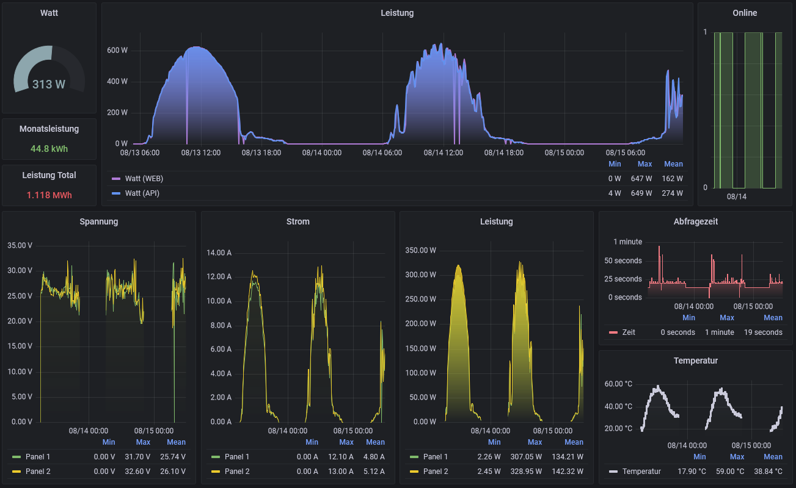

# Deye sun600g3-eu-230 Exporter for Prometheus

Prometheus Exporter for Deye Solar inverter. Works with firmware version `MW3_16U_5406_1.56`.

Depending on the WiFi stability, the data is queried faster or slower. To give the exporter enough time, the Prometheus timeout should be set to at least one minute.

Example Docker Setup: [Readme](setup/readme.md) (Runs fine on a Raspberry Pi with Docker)

The exporter is based on https://github.com/s10l/deye-logger-at-cmd

## Grafana

Dashboard example: [grafana.json](setup/grafana.json)



## Build the Container

```sh
DOCKER_BUILDKIT=1 docker build --progress=plain -t solar_exporter .
```

## Run the Container

```sh
docker run -d --name solar_exporter \
    -p 9942:9942 \
    -e DEYE_IP=192.168.2.15 \
    -e DEYE_USER=admin \
    -e DEYE_PASSWORD=admin \
    solar_exporter
```

## Example output 

```yml
# Solar Exporter
watt 555
today_e 11.1
total_e 22.2
online 1
voltage{panel="1"} 31.1
current{panel="1"} 9.4
voltage{panel="2"} 32.0
current{panel="2"} 8.1
temperature 32.7
executiontime 22
```

http://127.0.0.1:9942
